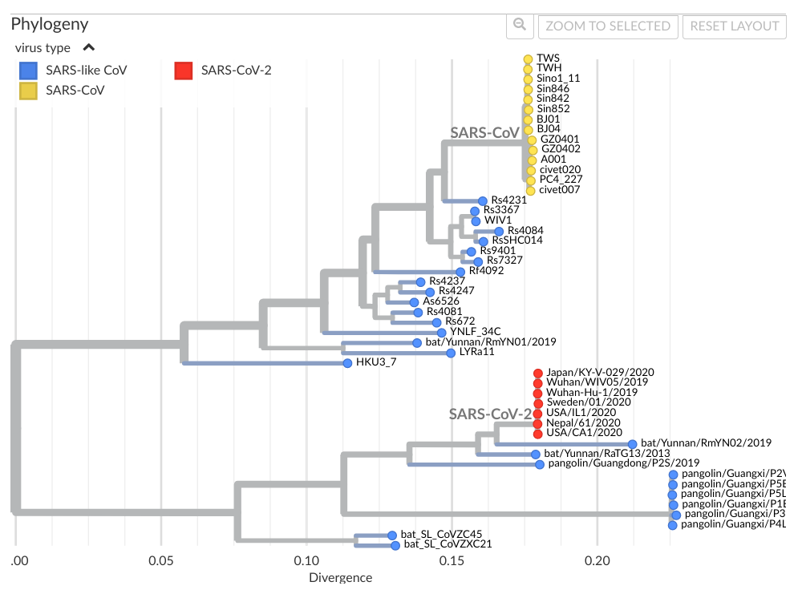

[toc](./README.md) | [next](comparing.md)

# Introduction

The life sciences study how biology orchestrates molecules to create living organisms.
An important central theme here is how the biomolecules impact life. The structure and
function of the major biomolecule classes (nucleic acids, proteins, fats, and sugars)
play a central role: the are the building blocks.

We found that how these biomolecules result in life is very structured. We found the 
evolutionary relation between DNA sequences and the similarity in proteins. We
discovered that how a protein folds up into a 3D structure is highly conserved. Not 
only does the same protein sequence strongly drive (there are exceptions) how the
protein folds up, but that proteins over many different species show similar protein
folds for similar biological roles. The latter is the foundation of, for example,
homology modelling which is used in drug discovery to study the function of proteins.

Therefore, being able to compare sequences is an extremely important tool in studying
biological systems. This material will look into why and how nucleotide changes in
DNA and RNA and amino acid changes in protein structures. Central in this topic is
that not every change has the same impact, and you will learn how biologists use that
insight when studying evolutionary aspects of DNA and protein sequences.

## From DNA via RNA to proteins

### Codons

The double helix of the DNA is transcribed into RNA which translated into protein sequences.
Three nucleotides in the DNA and RNA encode for a single amino acid in the protein sequence.
We know which [codon](https://en.wikipedia.org/wiki/DNA_and_RNA_codon_tables#Tables) results
in which amino acid. Not every nucleotide change means a change of the protein sequence.

### Protein folds

Proteins are biopolymers of amino acids, where individual amino acids are linearly linked via
peptide bonds. It is therefore also known as a polypeptide. The linear sequence of amino acids
folds up into secondary motives (alpha helices, beta strands,
etc) and a tertiary fold. This [protein fold](https://en.wikipedia.org/wiki/Protein_folding)
is deterministic: if a specific protein primary sequence does not always fold up into the same
fold, then the fold's biologically function would not be preserved. But it is. It is so
preserved, that similar primary protein sequence also result in the same fold. It can have small
changes, but the fold is quite well preserved. This results in [protein families](https://en.wikipedia.org/wiki/Protein_superfamily).

Therefore, there is a deterministic relation between the DNA sequence, via the RNA sequence
and the protein sequence, with the biological function. 

### Similar sequences

Because of this relation between DNA, RNA, and protein sequence and biological function,
comparing these sequences is of high interest too:

* if two sequences are sufficiently similar, they have the same biological role
* if two sequences of the genomes of two species are highly similar, these species are evolutionarily related
* some small changes in the DNA sequence cause changes in the protein sequence
* changes in the protein sequence can have effect on the biology

## Examples of sequence comparison

### Comparing DNA sequences

[Molecular phylogenetics](https://www.ncbi.nlm.nih.gov/books/NBK21122/) uses differences and similarities
to classify organisms into species. Combined with the idea of evolution, we have the foundation of the
tree of life. Differences and simlarities between organisms can also be defined by comparing their DNA.
Changes in DNA sequences, particularly, the number of changing nucleotides can be used as measure to
reflect how far two species diverged. This assumes, of course, that the number of nucleotides change
are a certain stable speed.

#### Questions

1. What does it mean when people say two species are 99% identical? <!-- button onclick="toggleAnswer('q1')">Answer</button> http://purl.enanomapper.org/onto/ENM_9000074

### Comparing RNA sequences

Possibly the most studies RNA sequence at this moment, is the sequence of the SARS-CoV-2 RNA.
Like with species, the similarity of RNA sequences can also be used to classify SARS-CoV-like virusses
([image is a screenshot taken of NextStrain](https://nextstrain.org/groups/blab/sars-like-cov)):

Using the same approach of stuyding the RNA sequences, it is possible to track how SARS-CoV-2 variants
spread over the world ([image of NextStrain]()):

#### Questions

1. Why can RNA sequences be used for contact research to see how the SARS-CoV-2 virus is spreading? <!-- button onclick="toggleAnswer('q1')">Answer</button> http://purl.enanomapper.org/onto/ENM_9000074

### Comparing protein sequences

The interactions of proteins with other proteins, with membranes, with small compounds (ligands, substrates) define
the rol in the biology of an organism. The backbone of a protein sequence is always identical
and only the amino acid side changes are different. The which [side chain](https://en.wikipedia.org/wiki/Amino_acid)
is found where in the polypeptide is defined by the codons, and therefore defined by evolution. Sometimes changing
a single sidechain can be major effects, such as in sickle-cell anemia. Here, a single glutamate is replaced by a valine
(see [this Proteopedia page](https://proteopedia.org/wiki/index.php/Hemoglobin)):

[toc](./README.md) | [next](comparing.md)

