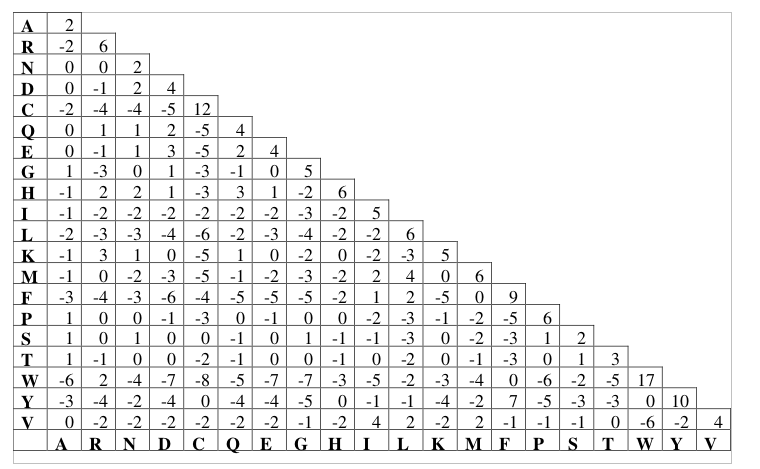
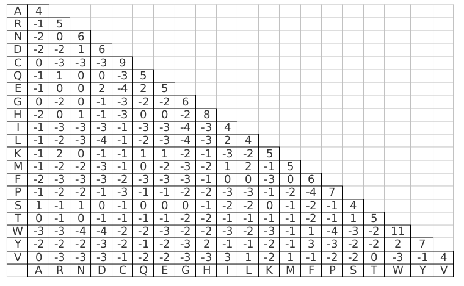

# Alignment ​scoring example (for proteins)

Comparing proteins is different from comparing nucleotide sequences. Basically, nucleotides
are the same or they are not. However, for amino acids this is more different. First of all,
some amino acids are encoded by more than one codon. Second, not every amino acid change
changes the protein structure and biological function a lot.

For example, the following two protein sequences can be aligned like this without
introducing a gap:

```
MLGDSAVLGT
||||||.|||
MLGDSAILGT
```

## Substition matrices: PAM and BLOSUM

Scoring schemes for nucleotides sequences are generally quite simple (a positive score for a
match, a negative score (penalty) for a mismatch, and penalties for any included gaps). For
protein sequences, scoring schemes are more involved as a good scoring scheme should take into
account the (dis)similarities of amino acids. This could possibly be done based on the group
membership, size, and other properties of the paired amino acids. However, in reality this is
done by studying real sequences. If one takes a large collection of protein sequences that are
similar enough to be sure about the correct alignment, one can simply count the number of
mutations from one amino acid to the next amino acid between these sequences. The more
mutations occur from one amino acid to the next, the more tolerable they apparently are, and
the higher the similarity is likely to be. When putting the number of mutations for each pair
of amino acids in a matrix, we obtain a so-called substitution matrix. After some mathematical
transformation of the values in the substitution matrix, we obtain a scoring matrix, with
positive values for combinations that are more likely than random chance, negative values for
combinations that are less likely than random chance, and zero values for combinations that are
as likely as expected from random chance. (Note: the details on the transformations required
to get from a substitution matrix to a scoring matrix do not have to be covered).

This approach is used by researchers to create commonly used scoring matrices. A well-known
collection of matrices is Dayhoff’s Point Accepted Mutations or PAM matrices. These are based
on global (full length) alignments of closely related proteins. It is important to work with
closely related proteins for two reasons:

* One has to be sure that the alignments used to design the scoring scheme are correct
  (since one obviously cannot use it yet when designing it)
* One has to be sure that each change has occurred by only one mutation; for example,
  with large evolutionary distance we can have:

```
Common ancestor        Ala
                      /   \
Extinct form       Gly     Ala
                    |       |
Current form       Arg     Ala
```
When only looking at the current forms, we may take this for a direct Ala to Arg mutation
in the left branch (if we have a full phylogenetic tree, we may deduce more information
about the ancestry of the protein).

### PAM matrices

The PAM matrices come in different versions: PAM1 is suited to compare very similar proteins
with no more than one mutation per 100 residues; PAM80 is suited to compare proteins with
up to 80 changes per 100 residues; PAM250 is suited to compare proteins with up to 250
changes per 100 residues (this is possible since each residue may have changed more than once
in distant proteins, as illustrated above; for 80 changes per 100 residues we expect 50
differences per 100 residues, for 250 changes we expect 80 differences per 100 residues).
The higher number PAM matrices are computed from the lower number ones using mathematical
operations (note: these are matrix multiplications, which do not have to be covered).
Generally, we can determine homology for proteins with a minimum of ~30% identity over a
substantial part of the sequence. The following figure shows the PAM250 scoring matrix:



### BLOSUM matrices

Another known collection of matrices is the BLOSUM collection, based on observed local
alignments (where only parts of the sequences may align). BLOSUM62, shown in the below figure,
is often used as a standard matrix, and is designed for proteins that are less than 62%
similar. It will work for both moderately distant proteins as well as for more closely
related proteins. For more distant proteins, there are other versions (such as BLOSUM45)
and for very related proteins one can opt for dedicated matrices (such as BLOSUM80).
Be aware that, where for PAM a higher number indicates suitability for more divergent
proteins, for BLOSUM a lower number is suited for more divergent proteins.



## Literature

* Henikoff S, Henikoff JG. Amino acid substitution matrices from protein blocks.
  Proceedings of the National Academy of Sciences. 1992 Nov 15;89(22):10915–9.
  https://doi.org/10.1073/pnas.89.22.10915 
