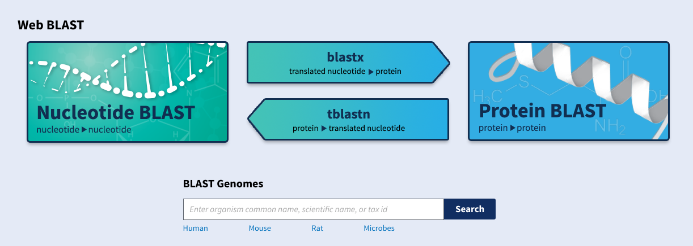

# Which BLAST to use

Blast can also be used to align two sequences, but is most commonly used to compare a
sequence against all entries in a database of sequences.

The NCBI BLAST website has a few variants that people can use:

* Nucleotide BLAST (blastn): search for similar nucleotide sequences in a nucleotide sequence database
* blastx: search protein databases using a translated nucleotide query
* tblastn: search translated nucleotide databases using a protein query
* Protein BLAST (blastp): search for similar protein sequences in a protein sequence database

Or, how NCBI visualizes it themselves:

